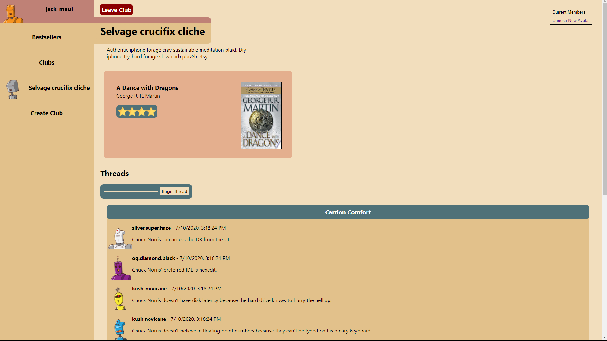

# The Library 📚

## Description
The Library is a social media experiment focused around bringing users together through books.
Users will create and join book clubs to discuss their current reads.

## Main Features
* Ruby on Rails as an API
* JSON Web Tokens to provide user authorization 🔒
* [New York Times Book API](https://developer.nytimes.com/docs/books-product/1/overview) to give users access to current Best Sellers
* [Google Books API](https://developers.google.com/books) 📖 for more detailed book information

  

* [Unsplash API](https://unsplash.com/documentation) for updating avatars
